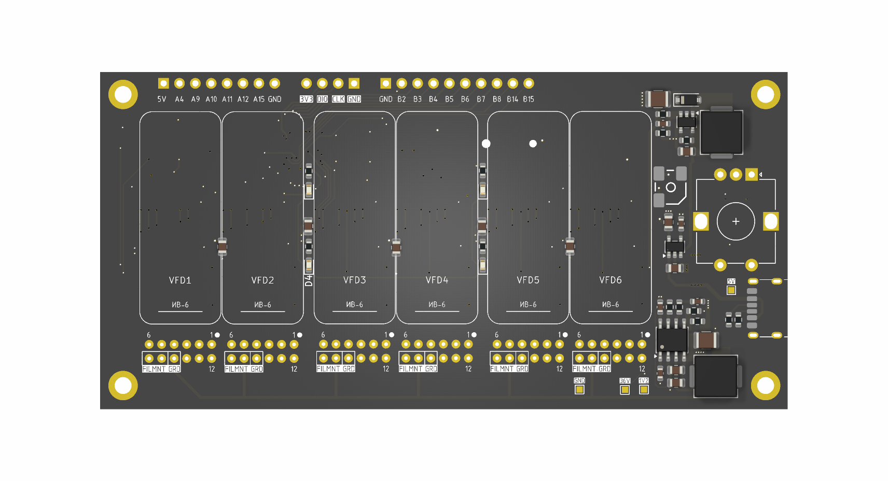
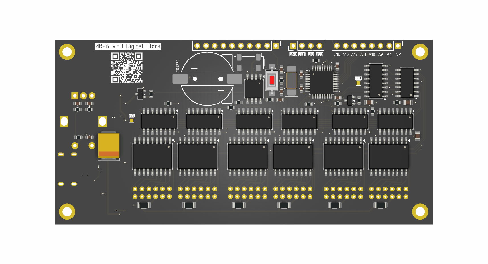

# ИВ-6 VFD Digital Clock
+ _board: revision 1_
+ _firmware: version 1.1_
## Overview
This is a basic 6-digit, 7-segment clock based on Soviet ИВ-6 vacuum fluorescent tubes, powered by an STM32F103CBT6 microcontroller. 
The core concept involves using a single 5V (USB-C) power source and converting the voltage to the 3.3V, 1.2V, and 30–35V levels required to operate the VFD tubes, microcontroller, and logic ICs. 
These circuits can be seen around the location of the rotary encoder on the right side of the board.

The circuit employs sequential updating of CD4511 BCD-to-7-segment latches and static control of the vacuum fluorescent tubes using TBD62783A eight-channel drivers. 
The static function of the VFD eliminates the flickering, extends the life of the lamps, but requires much more ICs.

The unused MCU pins are accessible via two 2.54 headers and can be used for an additional LEDs, buttons, logic circuitry etc.

## Hardware
+ [Interactive BOM HTML](http://htmlpreview.github.io/?https://github.com/nerovny/IV-6-VFD-Clock/blob/main/hardware/bom/ibom.html)
+ [Board dimensions](hardware/VFD_IV6_dimensions.png)
+ [Fabrication files]

## Firmware
The last binary is [HERE](https://github.com/nerovny/IV-6-VFD-Clock/releases)
Made with VSCode + PlatformIO using some HAL drivers. Source code is provided: just clone the repo and open the project with PIO VSCode plugin.
